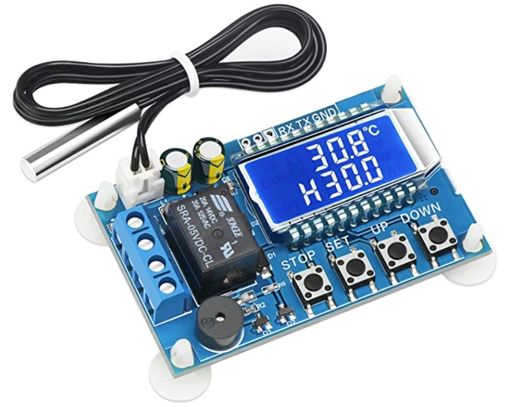

# DrokController
An Arduino sketch for the ESP32  to control / log data from a Thermostat Controller from Drok, Inc.

(see: http://www.Droking.com)
  
I got mine on Amazon: 
https://www.amazon.com/dp/B07GQPT9VG?psc=1&ref=ppx_yo2_dt_b_product_details

*Figure 1.* DROK Model: XY-T01

The program sets up two serial ports on an ESP32 - one to talk to the DROK, and one to report to the serial monitor in the Arduino IDE. You should be able to port this to other Arduino compatible boards pretty easily if they support multiple serial ports. 
  
After initializing the ports, setup() sends a "start" message to the controller to begin logging temperature and relay state. 
  
You can use either the serial monitor or serial plotter to look at the data. 
  
Commands typed in to the serial monitor will be routed to the DROK, so you can use this app to setup the controller as you wish. 
  
In playing with it, I find the following commands seem to work 
(NB: commands are case-sensitive!):
  
  * 'start' Turns on reporting. Temperature and Relay State are reported once a second.
  * 'stop' Turns off reporting. 
  * 'read' Gives a summary of the current parameters. (See datasheet) 
  * 'S:XX' Sets the setpoint in deg. C.  
         I haven't yet figured out how to set tenths of a degree...
  * 'ALA:XX.X' Sets alarm temperature. 
  
Other commands might work as well. I haven't tried this with other controllers from Drok. Free to explore. 

Comments / Suggestions / Pull requests welcomed. 

Regards, 

John.
  
 
